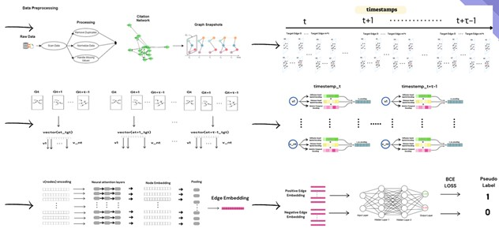

#  Our Approach
Our research focuses on analyzing the citation patterns of academic articles by applying advanced anomaly detection techniques in dynamic graphs. Using transformers, we aim to uncover irregularities and deviations in citation networks, which can provide insightful perspectives into the evolution and dissemination of knowledge across various fields of study.

The main objective of this research is to trace academic research trends over time by identifying unusual or unexpected citation behaviors. These anomalies may indicate the emergence of groundbreaking work, shifts in scientific paradigms, or even overlooked studies that later gain prominence. By detecting these patterns, we aim to offer a more nuanced understanding of how research evolves, how ideas spread, and how certain papers influence academic discourse.

Additionally, this approach allows us to highlight key papers and periods that have had significant impacts on their respective domains. Over time, tracking these trends can reveal the rise and fall of research topics, shifts in scholarly focus, and the factors contributing to the prominence of certain academic works. This analysis has the potential to aid researchers in identifying emerging fields, collaborators, and trends that could shape future studies.

In summary, our research seeks to combine the power of anomaly detection and transformer models to not only enhance citation analysis but also provide a tool for tracing and predicting the trajectory of academic research, offering valuable insights into its future direction.

# Our work is based on the following research and framework:
# TADDY: Anomaly detection in dynamic graphs via transformer
This repo covers an reference implementation for the paper "[Anomaly detection in dynamic graphs via transformer](https://arxiv.org/pdf/2106.09876.pdf) " By adapting it to identify anomalies concerning citations .


# Our preprocessing is integrated with the framework:



Some codes are borrowed from [Graph-Bert](https://github.com/jwzhanggy/Graph-Bert) and [NetWalk](https://github.com/chengw07/NetWalk) and [TADDY](https://github.com/yuetan031/TADDY_pytorch).

## Requirments
install the list from requirements24.txt 

## Usage
### Step 0: Prepare Data
```
```
### Step 1: Train Model
```
```

