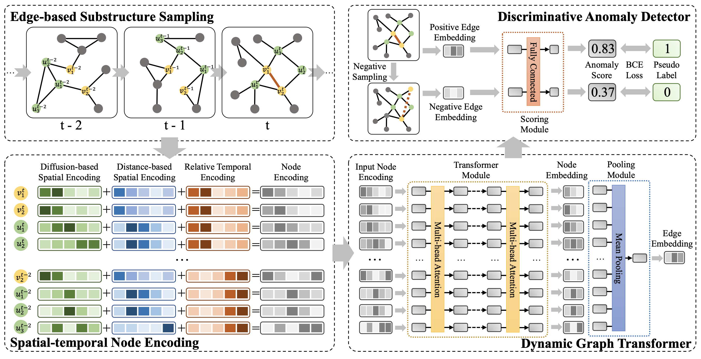

# TADDY: Anomaly detection in dynamic graphs via transformer
This repo covers an reference implementation for the paper "[Anomaly detection in dynamic graphs via transformer](https://arxiv.org/pdf/2106.09876.pdf) " By adapting it to identify anomalies concerning citations .



Some codes are borrowed from [Graph-Bert](https://github.com/jwzhanggy/Graph-Bert) and [NetWalk](https://github.com/chengw07/NetWalk) and [TADDY](https://github.com/yuetan031/TADDY_pytorch).

## Requirments
install the list from requirements24.txt 

## Usage
### Step 0: Prepare Data
```
python 0_prepare_data.py --dataset uci
```
### Step 1: Train Model
```
python 1_train.py --dataset uci --anomaly_per 0.1
```

